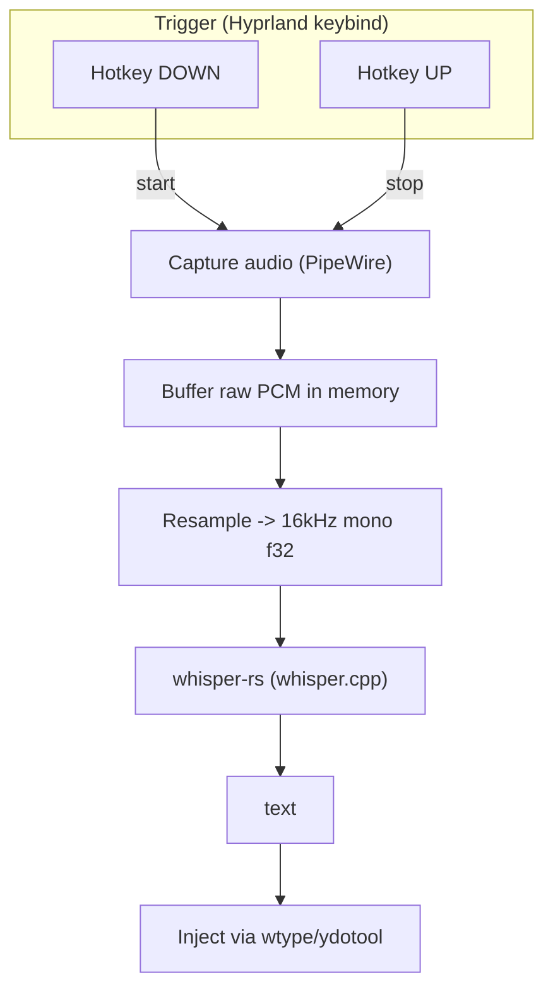

 Architecture: Push-to-Talk Dictation Pipeline

This document outlines the current architecture and data flow of **Mumble-It**, detailing how audio is captured, processed, transcribed, and injected into the active application.

## Pipeline Overview

---

## Pipeline Stages

### 1. Trigger (Hyprland Keybind)
- **Type**: Push-to-talk triggering via window manager / compositor keybinds (Hyprland).
- **Behavior**:
  - **`Hotkey DOWN`**: Emits the `start` signal to initiate audio capture.
  - **`Hotkey UP`**: Emits the `stop` signal to terminate audio capture and hand off data to the processing stages.

### 2. Audio Capture (PipeWire)
- Captures microphone input stream through the Linux PipeWire audio server while the hotkey is held down.

### 3. In-Memory PCM Buffering
- Stores the captured raw audio stream directly in memory as raw PCM data, eliminating unnecessary disk I/O overhead.

### 4. Audio Resampling
- Converts and normalizes the buffered PCM audio into **16 kHz, single-channel (mono), 32-bit floating-point (`f32`)** format, which matches the expected input format for the Whisper model.

### 5. Local Speech-to-Text (`whisper-rs` / `whisper.cpp`)
- Feeds the resampled `16kHz mono f32` audio buffer into `whisper-rs` (Rust bindings for `whisper.cpp`).
- Performs on-device transcription locally and outputs the resulting text string.

### 6. Text Injection (`wtype` / `ydotool`)
- Receives the transcribed text and simulates keystrokes to inject it directly into the currently focused window using Wayland input emulation utilities (`wtype` or `ydotool`).

---

## Related Documents
- [Design Decisions](DESICION.md): Rationale behind choosing Rust, `whisper.cpp`, and evaluation of alternative STT engines.
